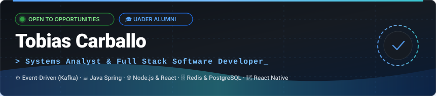

<!-- Header Banner Local & Animado -->

 

<!-- Typing Animation Subtitle -->

  

<!-- Badges de Contacto y Estado -->

  
  &nbsp;
  
  &nbsp;
  
  &nbsp;
  
  &nbsp;
  

 

<!-- Retrato ASCII y Tarjeta Neofetch Interactiva -->
<table>
  <tr>
    <td valign="top" width="370">
      
    </td>
    <td valign="top" width="490">
      
    </td>
  </tr>
</table>

---

## 💼 Sobre Mí

Soy **Analista en Sistemas de Información** graduado y estudiante avanzado de la **Licenciatura en Sistemas de Información** en la **UADER**.

Me apasiona diseñar y construir soluciones de software de extremo a extremo, con especial foco en **arquitectura backend, sistemas distribuidos, procesamiento asíncrono y aplicaciones móviles**.

- 🎓 **Educación**: Analista en Sistemas de Información (UADER) · Cursando Licenciatura en Sistemas de Información.
- ⚙️ **Foco de Ingeniería**: Arquitecturas orientadas a eventos (**Kafka**), APIs REST modulares y seguras, bases de datos relacionales/NoSQL optimizadas y caching avanzado con **Redis** (TTL, Geo-queries).
- 📱 **Mobile & Web**: Desarrollo de aplicaciones móviles multiplataforma con **React Native (Expo)** y experiencias web interactivas y escalables con **React, Next.js y Node.js**.
- 🌐 **Idiomas**: Español (Nativo) · Inglés (Competencia técnica profesional).

---

## 🛠️ Stack Tecnológico & Herramientas

  

 

| Área | Tecnologías & Herramientas |
| :--- | :--- |
| **💻 Lenguajes** | `TypeScript` `JavaScript (ES6+)` `Java` `Python` `SQL` `C#` `Bash` |
| **⚙️ Backend & Arquitectura** | `Spring Boot` `Node.js` `Express.js` `NestJS` `Apache Kafka` `Microservicios` `RESTful APIs` |
| **🗄️ Bases de Datos & Caching** | `PostgreSQL` `Redis (GEO / TTL / Ranking)` `MongoDB` `MySQL` `AWS DynamoDB` `Sequelize` `JPA/Hibernate` |
| **📱 Frontend & Mobile** | `React Native (Expo)` `React` `Next.js` `TailwindCSS` `HTML5` `CSS3` `JavaScript DOM` |
| **☁️ DevOps & Cloud** | `Docker` `Docker Compose` `AWS (DynamoDB / Cloud)` `Git` `GitHub Actions (CI/CD)` `Linux (Fedora/Ubuntu)` |
| **🔧 Herramientas & Métodos** | `Postman` `Figma` `UML & Modelado de Software` `JUnit` `Scrum / Agile` |

---

## 🚀 Proyectos Destacados

<table>
  <tr>
    <td width="50%" valign="top">
      <h3>💳 <a href="https://github.com/tobiascarballo/Docker-Banking-Microservices">Docker Banking Microservices</a></h3>
      
<b>Arquitectura orientada a eventos con procesamiento asíncrono de transacciones bancarias.</b>

      <ul>
        <li>Microservicios desacoplados y contenerizados con Docker y Docker Compose.</li>
        <li>Mensajería asíncrona y transmisión de eventos en tiempo real mediante <b>Apache Kafka</b>.</li>
        <li>Diseño modular con TypeScript y Node.js para alta disponibilidad y tolerancia a fallos.</li>
      </ul>
      

        
        
        
        
      

    </td>
    <td width="50%" valign="top">
      <h3>🛒 <a href="https://github.com/tobiascarballo/Ecommerce-MateUnico">Mate-Único — E-Commerce & Gestión</a></h3>
      
<b>Plataforma Full Stack integral para digitalización comercial de productos artesanales.</b>

      <ul>
        <li>Control de inventario, catálogo interactivo, carrito de compras y métricas de venta.</li>
        <li>Modelo de datos relacional normalizado en <b>PostgreSQL</b> con consultas optimizadas.</li>
        <li>Arquitectura modular y desacoplada garantizando escalabilidad y mantenimiento.</li>
      </ul>
      

        
        
        
        
      

    </td>
  </tr>
  <tr>
    <td width="50%" valign="top">
      <h3>✈️ <a href="https://github.com/tobiascarballo/TP6---Airports">Airports Tracking & Spatial Engine</a></h3>
      
<b>API geoespacial de alto rendimiento para búsqueda, seguimiento y ranking de aeropuertos.</b>

      <ul>
        <li>Persistencia principal de aeropuertos y rutas en <b>MongoDB</b>.</li>
        <li>Consultas geoespaciales por cercanía con <b>Redis GEO</b> y ranking de popularidad con <b>TTL</b>.</li>
        <li>Visualización interactiva en mapas con Leaflet.js y despliegue orquestado en Docker.</li>
      </ul>
      

        
        
        
        
      

    </td>
    <td width="50%" valign="top">
      <h3>☕ <a href="https://github.com/tobiascarballo/Challenge-ForoHub">ForoHub & LiterAlura — Java Spring APIs</a></h3>
      
<b>APIs REST empresariales desarrolladas con Java y el ecosistema Spring Boot.</b>

      <ul>
        <li>Seguridad y autenticación stateless robusta con <b>Spring Security</b> y tokens <b>JWT</b>.</li>
        <li>Persistencia relacional con <b>Hibernate / Spring Data JPA</b> y migraciones con <b>Flyway</b>.</li>
        <li>Consumo y procesamiento de APIs externas (Gutendex) con modelado de catálogos y estadísticas.</li>
      </ul>
      

        
        
        
        
      

    </td>
  </tr>
  <tr>
    <td width="50%" valign="top">
      <h3>☁️ <a href="https://github.com/tobiascarballo/AWS-Cloud-Database-Integration">AWS Cloud Integration Server</a></h3>
      
<b>Servidor TCP de baja latencia integrado con base de datos Cloud NoSQL en AWS.</b>

      <ul>
        <li>Servidor de sockets TCP multihilo desarrollado en Python para alto rendimiento y concurrencia.</li>
        <li>Integración directa y operaciones CRUD eficientes sobre <b>AWS DynamoDB</b>.</li>
        <li>Aplicación de patrones de arquitectura cloud para escalabilidad y tolerancia a fallos.</li>
      </ul>
      

        
        
        
        
      

    </td>
    <td width="50%" valign="top">
      <h3>📱 <a href="https://github.com/tobiascarballo/PracticaBase-React-Native">React Native Mobile Platform</a></h3>
      
<b>Desarrollo de aplicaciones móviles multiplataforma nativas y fluidas (iOS / Android).</b>

      <ul>
        <li>Construido con <b>React Native</b> y <b>Expo</b> utilizando <b>TypeScript</b> para tipado estricto.</li>
        <li>Arquitectura de componentes modulares y reutilizables con navegación fluida.</li>
        <li>Diseño responsive con enfoque moderno en User Experience (UX/UI).</li>
      </ul>
      

        
        
        
        
      

    </td>
  </tr>
</table>

---

## 📈 Métricas de GitHub & Actividad

  <table border="0">
    <tr>
      <td valign="middle">
        
      </td>
      <td valign="middle">
        
      </td>
    </tr>
  </table>

   

  <!-- Streak Stats Card -->
  

    

  <!-- Snake Contribution Animation -->
  <h4>🐍 Gráfico de Contribuciones</h4>
  

---

## 📫 Conectemos

¿Tenés un proyecto en mente, una propuesta laboral o querés charlar sobre desarrollo y arquitectura de software?

  
  &nbsp;&nbsp;
  
  &nbsp;&nbsp;
  

 

  © 2026 Tobias Carballo · Systems Analyst &amp; Software Developer · Built with Passion, SVG Keyframes &amp; GitHub Actions

