<!-- Heatmap de contribuciones -->

  

<!-- Retrato ASCII e Info Card alineados -->
<table>
  <tr>
    <td valign="top" width="370">
      
    </td>
    <td valign="top" width="490">
      
    </td>
  </tr>
</table>

 

<!-- Badges de Contacto y Perfiles -->

  
  &nbsp;
  
  &nbsp;
  

---

### 🚀 Proyectos Destacados

* **[Mate-Único: Gestión de Stock](https://github.com/tobiascarballo/Ecommerce-MateUnico)**  
  Solución Full Stack para optimización de inventario, tracking de productos, clientes y métricas de venta.

* **[Microservicios de Transacciones Bancarias](https://github.com/tobiascarballo/Docker-Banking-Microservices)**  
  Arquitectura orientada a eventos diseñada con **Node.js**, **Apache Kafka** y contenedores en **Docker**.

* **[AWS Cloud Integration & Design Patterns](https://github.com/tobiascarballo/AWS-Cloud-Database-Integration)**  
  Servidor TCP escalable integrado directamente con **AWS DynamoDB** aplicando patrones de diseño.

---

  Built with Python, SVG Keyframe Animations & GitHub Actions.

